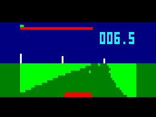

# 3D driving for Cosmac VIP

[English](README_en.md)


Cosmac VIP 用の疑似 3D ドライビングゲーム(タイムアタックのみ)です。
1980 年頃にできていれば多少話題になったかもしれません…





作った後、2020 年頃に Studio II 用に作られた
[レーシングゲーム](https://github.com/azya52/rcastudioii) (Emma 02 にも収録)を知りました。
高解像度で、スピード感があります([動画](https://www.youtube.com/watch?v=73bKfeSIkP0))。
これをポートした方が良かったかも…
こちらの方がよりシミュレーション寄りという違いはあります(その分、爽快感が低い…)。


## 使用法

実機の場合 WAV が読み込めると思います(Emma 02 で出力しました)。
Emma 02 の場合 RAM に driving_vip.bin や dviving_vip_color.bin を読み込んでください。
VIP on Pico 用に、4KB まで 0 で埋めたものも置いておきます。
Elf で使えると思われるバイナリも作りましたが、
キー操作の点で無理がありそうです。

[driving_vip.wav](driving_vip.wav)
/ [driving_vip.bin](driving_vip.bin)
/ [driving_vip_4kb.bin](driving_vip_4kb.bin) 
/ [driving_elf.bin](driving_elf.bin)

[driving_vip_color.wav](driving_color_vip.wav)
/ [driving_vip_color.bin](driving_color_vip.bin)
/ [driving_vip_color_4kb.bin](driving_vip_color_4kb.bin) 


そこそこ頑張ったのですが、まだ微妙に 10 FPS を切っています。
(VSYNC に同期はしていません。)

ハンドルの効きやコースの変更などについては、driving.asm をご覧ください。
ただし、値によっては結構簡単に計算が破綻するかもしれません。

[sbasm](https://www.sbprojects.net/sbasm/)でアセンブルできます。
すべての asm ファイルを同じ場所に入れ、
```
sbasm driving.asm
```
でアセンブルしてください。

開発には、まず [TIC-80](https://tic80.com/) で[プロトタイプ](carrace_vip.tic)を作りました。
その後、sdasm でアセンブルしたものを Emma 02 で実行し修正する、
というサイクルを繰り返しました。
当時の体験を再現する、という点では
ハンドアセンブルまたは VIP 上のアセンブラを使うべきだったかもしれませんが、
まあそれはちょっときついので…

