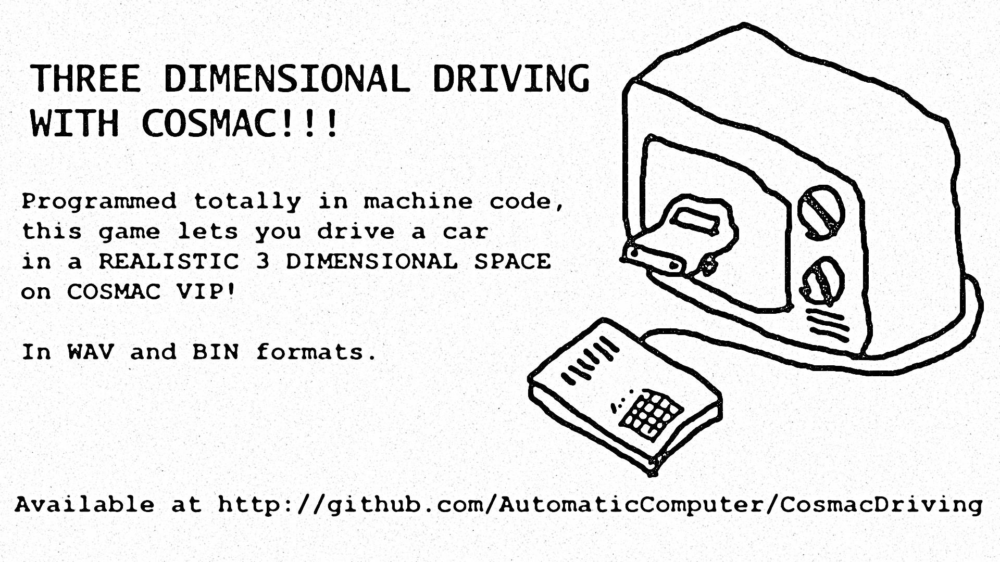
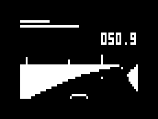

# 3D driving for Cosmac VIP



Cosmac VIP 用の疑似 3D ドライビングゲーム(タイムアタックのみ)です。
1980 年頃にできていれば多少話題になったかもしれません…



Emma 02 の場合 RAM に driving.bin を読み込んでください。
あるいは、wav ファイルをカセットにセットしてモニターで読み込むこともできます。
VIP on Pico 用に、4KB まで 0 で埋めたものも置いておきます。

[bin](driving.bin) [WAV](driving.wav)
[bin(4KB)](driving.bin) 

そこそこ頑張ったのですが、まだ微妙に 10 FPS を切っています。
(VSYNC に同期はしていません。)

ハンドルの効きやコースの変更などについては、driving.asm をご覧ください。
ただし、値によっては結構簡単に計算が破綻するかもしれません。

[sbasm](https://www.sbprojects.net/sbasm/)でアセンブルできます。
すべての asm ファイルを同じ場所に入れ、
```
sbasm driving.asm
```
でアセンブルしてください。

開発には、まず [TIC-80](https://tic80.com/) で[プロトタイプ](carrace_vip.tic)を作りました。
その後、sdasm でアセンブルしたものを Emma 02 で実行し修正する、
というサイクルを繰り返しました。
当時の体験を再現する、という点では
ハンドアセンブルまたは VIP 上のアセンブラを使うべきだったかもしれませんが、
まあそれはちょっときついので…
