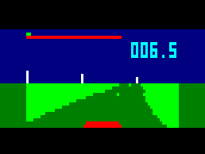

# 3D driving for Cosmac VIP

[Japanese](README.md)


A pseudo-3D driving game (time attack) for Cosmac VIP. 
If this were available in around 1980, it might have attracted some attention...





After finishing the first version, 
I became aware of a 
[racing game for Studio II](https://github.com/azya52/rcastudioii) (also included in Emma 02 distribution), 
developed in 2020. 
It has a great hi-res graphics ([Movie](https://www.youtube.com/watch?v=73bKfeSIkP0)). 
Perhaps I should have ported it to VIP...
One difference is that mine is more like a driving simulation 
(which might make it less fun). 


## How to play

On a real VIP, I think the WAV (output from Emma 02) can be read. 
On Emma 02, load driving_vip.bin or dviving_vip_color.bin as RAM SW. 
For VIP on Pico, 4KB binaries are also available. 

There is also a binary for Elf, 
but I think this is hard to play because 
it can not read two key presses simultaneously. 


[driving_vip.wav](driving_vip.wav)
/ [driving_vip.bin](driving_vip.bin)
/ [driving_vip_4kb.bin](driving_vip_4kb.bin) 
/ [driving_elf.bin](driving_elf.bin)

[driving_vip_color.wav](driving_color_vip.wav)
/ [driving_vip_color.bin](driving_color_vip.bin)
/ [driving_vip_color_4kb.bin](driving_vip_color_4kb.bin) 


I wanted the program to attain 10 FPS, but it slightly falls short. 

To change the setting of the steering and the course, see driving.asm, 
but some changes might easily lead to overflow. 


The source can be assembled with [sbasm](https://www.sbprojects.net/sbasm/). 
Do 
```
sbasm driving.asm
```
with all asm files in the same directory. 

I used [TIC-80](https://tic80.com/) for [prototyping](carrace_vip.tic). 
After, 
I wrote the assembly source, assembled it with sbasm and ran the executive on Emma 02. 
To experience what it was like in 1980, 
perhaps I should have hand-assembled or used an assembler on VIP, 
but it would have taken much more effort...

